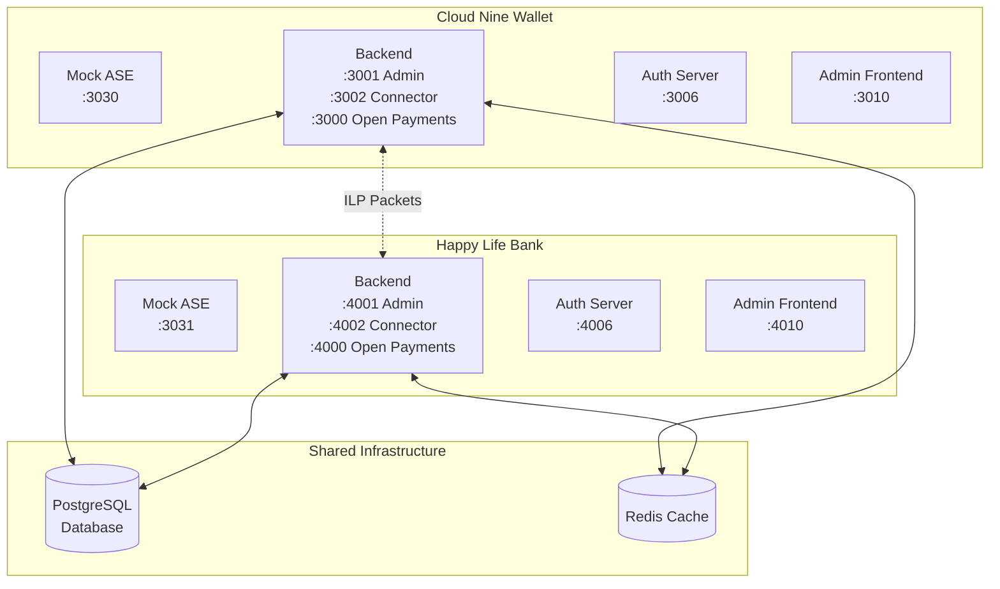
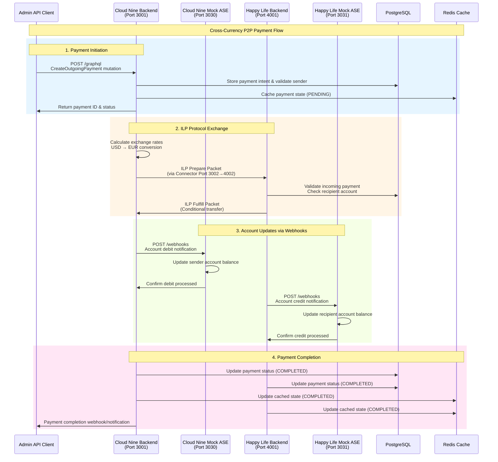

# Rafiki Peer-to-Peer Cross Currency Payment Flow

This document illustrates the event flow for a cross-currency payment between Cloud Nine Wallet and Happy Life Bank using the Rafiki Admin API.

## Architecture Overview

Install "Markdown Preview Mermaid Support" extension in VSCode to visualize the diagrams.



## Payment Event Flow



## Key Components & Ports

### Cloud Nine Wallet

- **Mock ASE**: `localhost:3030` - Customer wallet interface
- **Backend Admin API**: `localhost:3001` - GraphQL management
- **Backend Connector**: `localhost:3002` - ILP communication
- **Backend Open Payments**: `localhost:3000` - Open Payments API
- **Auth Server**: `localhost:3006` - OAuth/authentication
- **Admin Frontend**: `localhost:3010` - Administrative UI

### Happy Life Bank

- **Mock ASE**: `localhost:3031` - Customer wallet interface
- **Backend Admin API**: `localhost:4001` - GraphQL management
- **Backend Connector**: `localhost:4002` - ILP communication
- **Backend Open Payments**: `localhost:4000` - Open Payments API
- **Auth Server**: `localhost:4006` - OAuth/authentication
- **Admin Frontend**: `localhost:4010` - Administrative UI

## Environment Variables Configuration

Both wallets use the same `rafiki-mock-ase` image but differentiate through environment variables:

### Cloud Nine Configuration

```yaml
DISPLAY_NAME: Cloud Nine Wallet
DISPLAY_ICON: wallet-icon.svg
OPERATOR_TENANT_ID: 438fa74a-fa7d-4317-9ced-dde32ece1787
FRONTEND_PORT: 3010
```

### Happy Life Bank Configuration

```yaml
DISPLAY_NAME: Happy Life Bank
DISPLAY_ICON: bank-icon.svg
OPERATOR_TENANT_ID: cf5fd7d3-1eb1-4041-8e43-ba45747e9e5d
FRONTEND_PORT: 4010
```

## Data Flow Summary

1. **Admin API** initiates payment via GraphQL mutation
2. **ILP Connectors** handle cross-currency exchange and routing
3. **Mock ASEs** manage actual account debits/credits via webhooks
4. **PostgreSQL** stores persistent payment and account data
5. **Redis** caches real-time payment states for performance
6. **Tenant IDs** ensure data isolation between wallet instances

The system demonstrates a complete Interledger payment flow with proper separation of concerns between payment processing (backends) and account management (ASEs).
